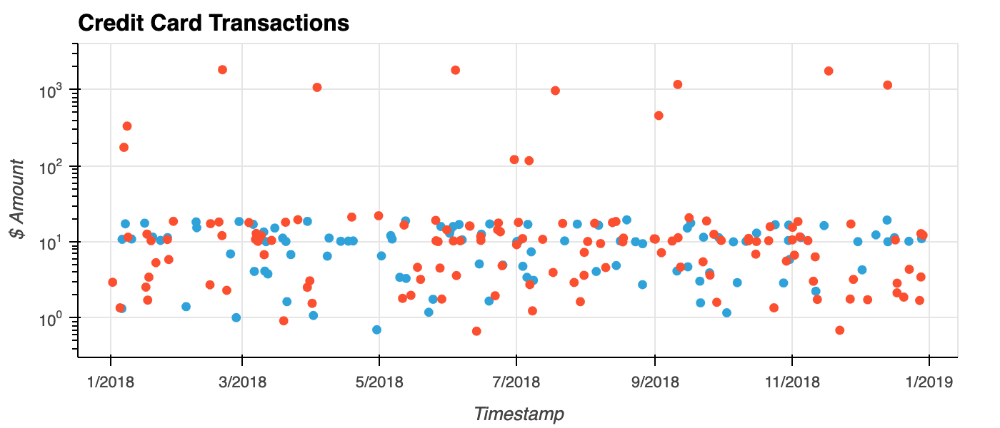
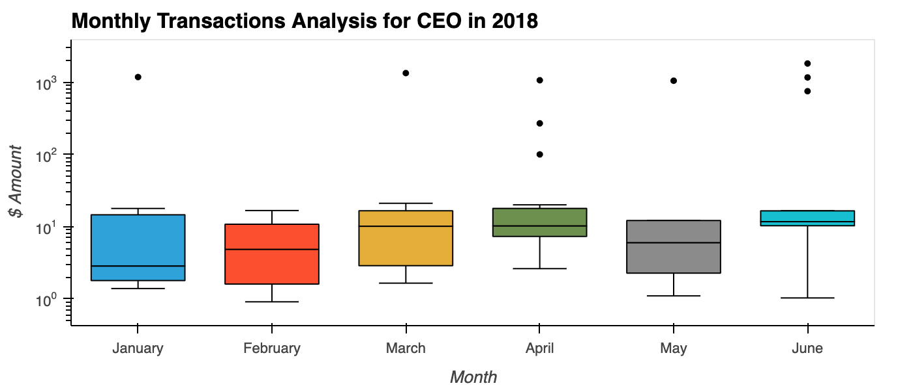
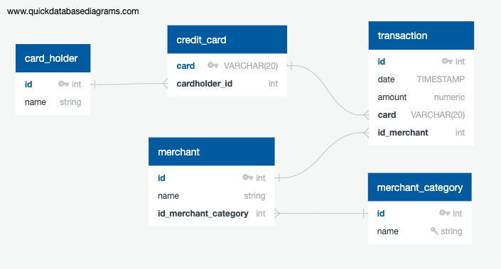

# ccfraudster - Credit Card Fraud Detection

### Unit 7 Assignment by Juil for UofT Fintech Bootcamp

Import credit card transaction records and run analysis to evaluate for fraudulent activity.

## Data Analysis Results

### Part 1

**Queries:** [data_analysis.sql](query/data_analysis.sql)

1. Transactions Less Than $2

|cardholder_id|tx_lessthan2|
|-------------|------------|
|12|26|
|19|22|
|24|22|
|11|21|
|10|20|
|16|19|
|18|19|

While having a high number of transactions under $2 raises an eyebrow, it is not so indicative of fraudulent activity when counted over such a long period of time.

2. Top Transactions Made 07:00-09:00

|id|date|amount|card|
|--|----|------|----|
|3163|2018-12-07 07:22:03.000|1894.00|4761049645711555811|
|2451|2018-03-05 08:26:08.000|1617.00|5570600642865857|
|2840|2018-03-06 07:18:09.000|1334.00|4319653513507|
|1442|2018-01-22 08:07:03.000|1131.00|5570600642865857|
|968|2018-09-26 08:48:40.000|1060.00|4761049645711555811|
|1368|2018-09-06 08:28:55.000|1017.00|4761049645711555811|
|1620|2018-03-26 07:41:59.000|1009.00|30181963913340|

Credit cards 4761 and 5570 both have multiple $1000+ transactions between 07:00-09:00. This is suspicious because the types of stores that carry such high-ticket items would not be open at this time of the day. 

3. Top Merchants Prone to Being Hacked Using Small Transactions

|merchant_name|tx_lt2_count|
|-------------|------------|
|Wood-Ramirez|7|
|Baker Inc|6|
|Hood-Phillips|6|
|Sweeney-Paul|5|
|Greene-Wood|5|
|Hamilton-Mcfarland|5|
|Riggs-Adams|5|

The top 5 merchants with high transactions less than $2 are Wood-Ramirez, Baker Inc, Hood-Phillips, and several merchants tied for 4th place including Sweeney-Paul, Greene-Wood, and Hamilton-Mcfarland.

### Part 2: Plot Credit Card Transactions

1. Plot VIP Transactions

Plot multiple card holders' credit card transactions on a log scale to visually see distribution of transactions.

 
*(Used a scatter plot on a log scale to better visualize patterns in spending amounts.)*

The primary difference in the consumption patters is that card holder #18 (red) will occasionally make expensive purchases, whereas #2 (blue) does not.

This doesn't necessarily indicate any sort of fraud. More analysis must be done.

2. Plot CEO's Transactions as Box Plot

Plot 6 months of CEO's credit card transactions to look for fraud.

*(Log scale used for better visualization of data.)

There are a total of 9 outliers for cardholder #25 and an average of 1.5 per month.

The main anomoly that shows up in the plot is that #25 seems to be an overall frugal spender, but there are quite a few big purchases, expecially in April and June.

However, 6 months is not enough time to check for anmolies. Ideally the time frame will be over a year.

#### Code 

[visual_data_analysis.ipynb](visual_data_analysis.ipynb)

#### Schema

Exported with [QuickDBD](https://app.quickdatabasediagrams.com/#/d/8JR3xd)
[schema.sql](data/schema.sql)

#### Database 

Postgres Database: [`data/fraud_detection-db.sql`](data/fraud_detection-db.sql`)

Seed data: [`data/`](data/)

#### Queries

[visual_data_analysis.sql](query/visual_data_analysis.sql)

## Notes
1. Starter code and seed data provided by UofT. 
2. ERD and schema created in QuickDBD.
